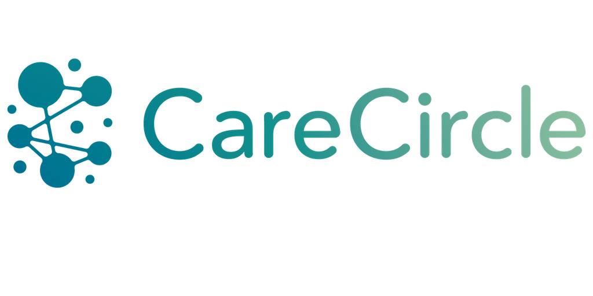
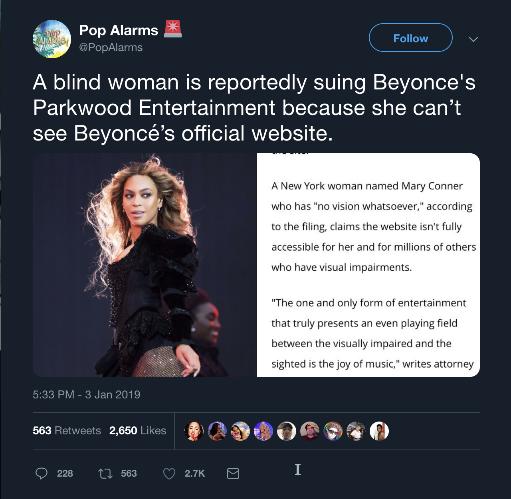
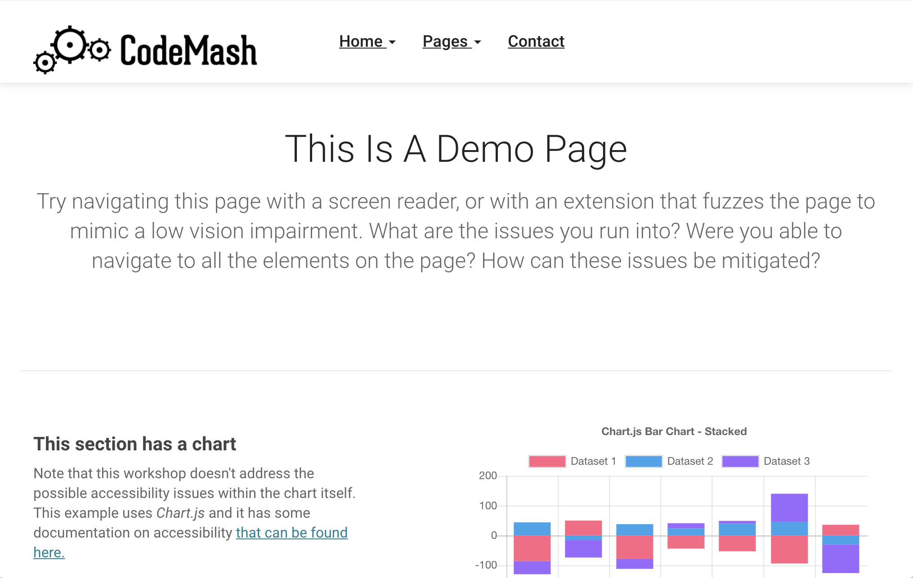
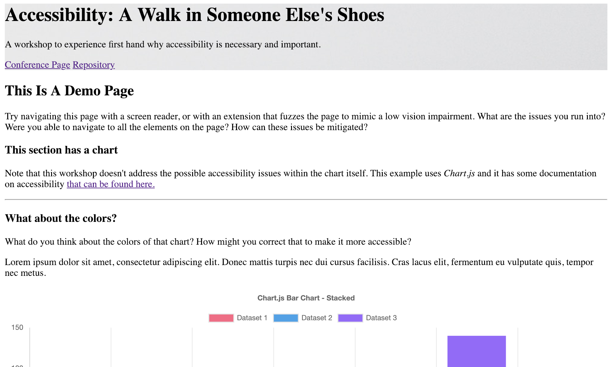
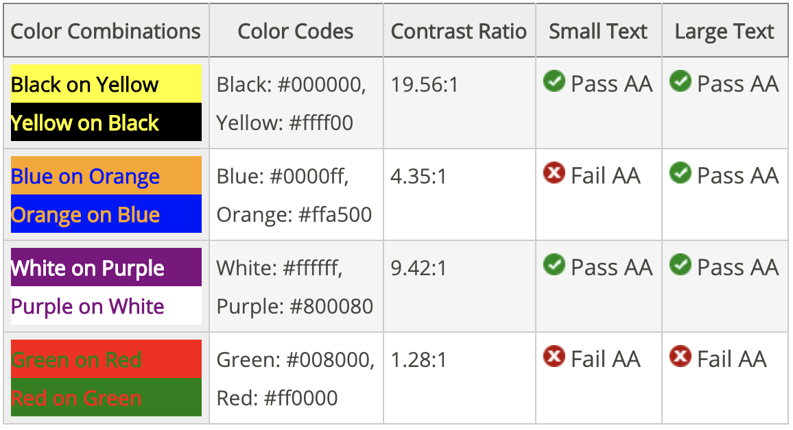

import {
    Blurred,
    ColorBlind,
    Layout,
    Theme
} from './'
import {
    Appear,
    Head
} from 'mdx-deck'

export default Theme

<Head>
  <title>Accessibility: A Walk in Someone Else's Shoes</title>
</Head>

export default Blurred

# Accessibility:
## A Walk in Someone Else’s Shoes

##### A workshop to experience first hand why accessibility is necessary and important.

---

export default ColorBlind

# Accessibility:
## A Walk in Someone Else’s Shoes

##### A workshop to experience first hand why accessibility is necessary and important.

---

# Accessibility:
## A Walk in Someone Else’s Shoes

##### A workshop to experience first hand why accessibility is necessary and important.

---

# Poll

```notes
* anyone have a disability?
* anyone have a disability that affects using the web?
* anyone test for accessibility in their apps?
* anyone work for a public agency?
```

---

# Me

<ul style={{ listStyle: 'none', paddingLeft: '0' }}>
    <Appear>
        <li>Senior Application Developer @ OST</li>
        <li>Co-founder/Lead developer @ CareCircle</li>
        <li><a href="https://twitter.com/NathanLoding">@NathanLoding</a>*</li>
    </Appear>
</ul>  

---



---

# What is "A11Y"

"Accessibility" == "A" + 11 letters + "y"

---

# Why is A11y important?

<ul style={{ listStyle: 'none', paddingLeft: '0' }}>
    <Appear>
        <li>In the United States ...</li>
        <li><strong>1 in 5</strong> Disabled</li>
        <li><strong>8.1 Million</strong> Visually impaired</li>
        <li><strong>2 Million</strong> Blind</li>
        <li><strong>7.6 Million</strong> Auditory impaired</li>
        <li><strong>2.2 Million</strong> Suffer seizures/epilepsy</li>
        <li><strong>19.9 Million</strong> Motor impaired</li>
    </Appear>
</ul>        

---


---



---

# Agenda

<ul style={{ listStyle: 'none', paddingLeft: '0' }}>
    <Appear>
        <li>Overview of common disabilities</li>
        <li>Overview of WCAG 2.0</li>
        <li>Set up for exercises</li>
        <li>Exercise 01: No Vision</li>
        <li>Exercise 02: Low Vision</li>
        <li>Exercise 03: Mobility Impairment</li>
        <li>Tools for auditing sites</li>
        <li>Testing for accessibility</li>
    </Appear>
</ul> 

---

# Common disabilities

---

# Visual disabilities

<ul style={{ listStyle: 'none', paddingLeft: '0' }}>
    <Appear>
        <li>Color blindness (generally red-green, yellow-blue)</li>
        <li>Low vision (blurry, clouded, seeing only the edges, seeing only the middle)</li>
        <li>Blindness (substantial vision loss in one or both eyes)</li>
    </Appear>
</ul> 

---

# Cognitive/learning/neurological disabilities

<ul style={{ listStyle: 'none', paddingLeft: '0' }}>
    <Appear>
        <li>ADHD</li>
        <li>Autism Spectrum</li>
        <li>Mental health disabilities (anxiety, delirium, etc.)</li>
        <li>Memory impairments (includes dementia)</li>
        <li>Perceptual impairments (commonly called learning disabilities)</li>
        <li>Seizure disorders</li>
    </Appear>
</ul> 

---

# Auditory disabilities

<ul style={{ listStyle: 'none', paddingLeft: '0' }}>
    <Appear>
        <li>Hard of hearing (mild to moderate hearing impairment in one or both ears)</li>
        <li>Deafness (substantial hearing impairment in both ears)</li>
    </Appear>
</ul> 

---

# Physical disabilities

<ul style={{ listStyle: 'none', paddingLeft: '0' }}>
    <Appear>
        <li>Amputation</li>
        <li>Arthritis</li>
        <li>Paralysis</li>
        <li>Repetitive stress injury</li>
    </Appear>
</ul> 

---

# Speech disabilities

<ul style={{ listStyle: 'none', paddingLeft: '0' }}>
    <Appear>
        <li>Muteness</li>
        <li>Dysarthia (weakness or paralysis of speech muscles)</li>
        <li>Stuttering</li>
    </Appear>
</ul> 


---

# WCAG 2.0

<a href="https://www.w3.org/TR/WCAG20/" target="_blank">Link</a>

---

# POUR

<ul style={{ listStyle: 'none', paddingLeft: '0' }}>
    <Appear>
        <li><strong>P</strong>erceivable</li>
        <li><strong>O</strong>perable</li>
        <li><strong>U</strong>nderstandable</li>
        <li><strong>R</strong>obust</li>
    </Appear>
</ul> 

---

# Perceivable

---

## Provide text alternatives for any non-text content so that it can be changed into other forms people need, such as large print, braille, speech, symbols or simpler language.

---

```html
<button class="btn btn-primary"><i class="fa fa-trash"></i></button>
```

becomes

```html
<button class="btn btn-primary"><i class="fa fa-trash"></i> Remove</button>
<button class="btn btn-primary" aria-label="Remove"><i class="fa fa-trash"></i></button>
```

---

```html

```

becomes

```html

```

*_NOT_*

```html

```

---

## Provide alternatives for time-based media

Provide captions or transcripts for your audio/visual content. Sign language for live events.

---

## Create content that can be presented in different ways (for example simpler layout) without losing information or structure

Semantic structure matters! Tab order matters!

---



---



---

## Make it easier for users to see and hear content including separating foreground from background

---

```html
<div class="alert alert-danger">This is some text</div>
```

becomes

```html
<div class="alert alert-danger"><i class="fa fa-exclamation"></i> This is some text</div>
```

---

## Focus

Does the element have a focus state that clearly indicates that it is currently in focus?

If your page refreshes data, does it retain focus on the right data?

---

## Contrast

## WCAG 2.0 AA: 4.5:1 / 3.1 (large text)



---

# Operable

---

## Make all functionality available from a keyboard

---

```jsx
 this.props.callback()} />
```

becomes

```jsx
 event.key === 'Enter' && this.props.callback()} />
```

---

## Provide users enough time to read and use content

---

## Do not design content in a way that is known to cause seizures

---

## Provide ways to help users navigate, find content, and determine where they are

<ul style={{ listStyle: 'none', paddingLeft: '0' }}>
    <Appear>
        <li>Semantic headings: one <code>h1</code> per page, decrement headings</li>
        <li>Labels on form elements</li>
        <li>Use of <code>&lt;main /></code>, <code>&lt;section /></code>, and <code>&lt;article /></code> </li>
        <li>"Skip to" or "Skip Navigation" links</li>
    </Appear>
</ul> 

---

# Understandable

---

## Make text content readable and understandable

Set a language on your page! `<html lang="en">`

Or mark individual bits as another language: `<span lang="fr">C'est la vie</span> isn't in English.`

Use `<abbr>` when applicable

---

## Make Web pages appear and operate in predictable ways

<ul style={{ listStyle: 'none', paddingLeft: '0' }}>
    <Appear>
        <li>Manage focus state, especially in SPA's</li>
        <li>Consistent navigation</li>
        <li>Don't change the interface without user input ...</li>
        <li>... or change the interface while users are interacting with it</li>
    </Appear>
</ul> 

---

## Help users avoid and correct mistakes

<ul style={{ listStyle: 'none', paddingLeft: '0' }}>
    <Appear>
        <li>Error identification (borders, colors, etc.)</li>
        <li>Error suggestions (how to correct the issue)</li>
        <li>Contextual help</li>
        <li>Data entry should be <em>reversible</em>, <em>checked</em>, and <em>confirmed</em></li>
    </Appear>
</ul> 

---

# Robust

---

## Did you meet all the other criteria?

---

# Exercises!

---

## Have you used a screen reader before? Have you used ChromeVox before?

[ChromeVox Keyboard Controls](http://www.chromevox.com/keyboard_shortcuts.html)

---

# Exercise 01: No Vision

## Requirements

* A blindfold
* Headphones
* A screen reader that works with Chrome, like [ChromeVox](http://www.chromevox.com/installing.html "ChromeVox")

---

# Exercise 01: No Vision

## Steps

1. Open `Exercise 01: No Vision` in your browser, _and try not to look at the page_
2. Turn on your screen reader
3. Cover your eyes with the blindfold, or otherwise obstruct the screen
4. Attempt to navigate the page

---

# Exercise 01: No Vision

## Questions

* Were you able to identify all the form elements, in a meaningful way?
* Were you able to identify what each link and button element was for?
* Did the page move around logically?

---

# Exercise 02: Low Vision

## Requirements

* [ChromeLens extension](https://chrome.google.com/webstore/detail/chromelens/idikgljglpfilbhaboonnpnnincjhjkd "ChromeLens")

---

# Exercise 02: Low Vision

## Steps

1. Open `Exercise 02: Low Vision` in your browser, _and try not to look at the page_
2. Open the Chrome Dev Tools
3. Open the "ChromeLens" dev tool tab
4. Check the box for "Enable Lens"
5. Start with "Partial Blindness (medium)"
6. Attempt to navigate the page
7. Repeat with different vision impairments, such as "Protanopia (red-blind)" and "Tritanopia (blue-blind)"

---

# Exercise 02: Low Vision

## Questions

* Were you able to identify what elements has focus?
* Were you able to distinguish between the elements on the graph?
* Were you able to identify *at a glance* whether the alert above the form was informational or an error?

---

# Exercise 03: Mobility Impairment

## Requirements

* If you have an external mouse, disconnect it!
* If you are using a trackpad ... pretend it's not there!

---

# Exercise 03: Mobility Impairment

## Steps

1. Open `Exercise 03: Mobility Impairment` in your browser, _and try not to look at the page_
2. Attempt to navigate the page _without using your mouse/trackpad_

---

# Exercise 03: Mobility Impairment

## Questions

* Were you able to identify what elements has focus?
* Did the page move around logically?
* Were there significant differences in navigating the page with your eyes open and no mouse compared to
`Exercise 01: No Vision`?

---

# Thanks for coming!